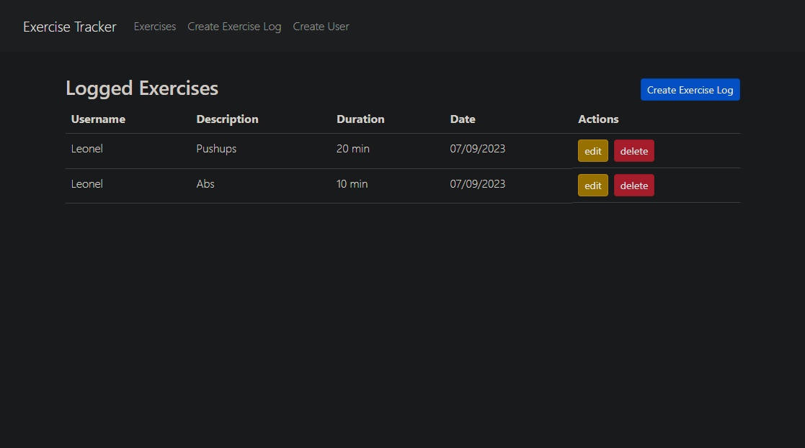
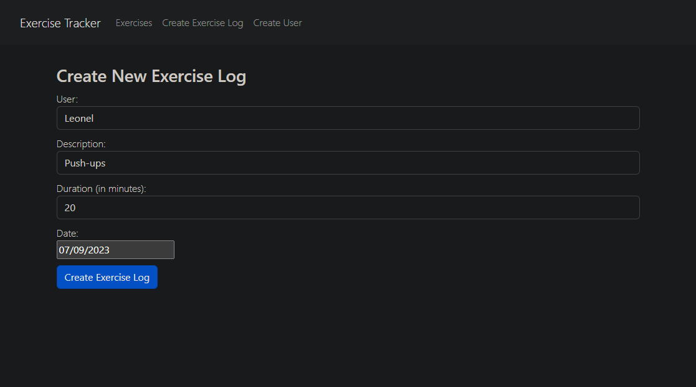
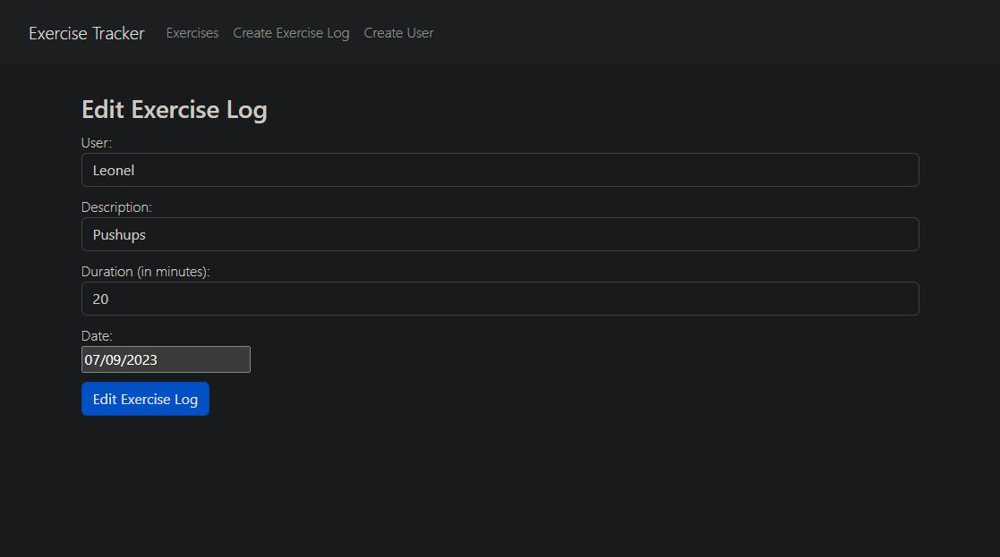
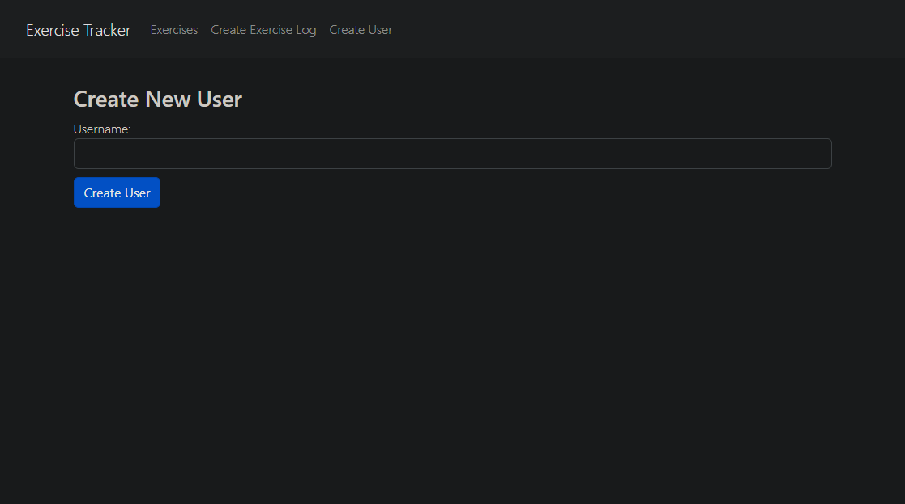

# Exercise tracker

[](https://open.vscode.dev/LeooZeballos/fast-food) [](https://github.com/LeooZeballos/exercise-tracker/issues) [](https://github.com/LeooZeballos/exercise-tracker/network) [](https://github.com/LeooZeballos/exercise-tracker/stargazers) [](https://opensource.org/licenses/MIT)

## Table of contents
* [General info](#General-info)
* [How to Install and Run the Project](#How-to-Install-and-Run-the-Project)
* [Technologies](#Technologies)
* [Features](#Features)
* [License](#License)

## General info

Simple MERN stack app to track exercises.

## How to Install and Run the Project

### Render

This app is deployed on Render: [Frontend](https://exercise-tracker-frontend-ufsi.onrender.com/) | [Backend](https://exercise-tracker-backend-ahhh.onrender.com/).

### Local

#### Requirements

- [Node.js](https://nodejs.org/en/)
- [MongoDB](https://www.mongodb.com/)

#### Steps

1. Clone this repository: `git clone https://github.com/LeooZeballos/exercise-tracker.git`
2. Install dependencies in the backend and frontend directory with: `npm install`
3. Create a .env file in the backend directory and add the following variables:

```bash
ATLAS_URI=your_mongodb_uri
PORT=5000
```

4. Create a .env file in the frontend directory and add the following variables:

```bash
REACT_APP_API_URL=http://localhost:5000
```
5. Run the backend with: `npm start` in the backend directory
6. Run the frontend with: `npm start` in the frontend directory
7. Open [http://localhost:3000](http://localhost:3000) to view it in the browser.

### Docker

1. Clone this repository: `git clone https://github.com/LeooZeballos/exercise-tracker.git`
2. Create a .env file in the frontend directory and add the following variables:

```bash
REACT_APP_API_URL=http://localhost:5000
```

3. Build the images with: `docker build -t exercise-tracker-frontend frontend` and `docker build -t exercise-tracker-backend backend`
4. Run the containers with `docker compose up -d`
5. Open [http://localhost:3000](http://localhost:3000) to view it in the browser.

## Technologies

[](https://reactjs.org/)
[](https://nodejs.org/en/)
[](https://expressjs.com/)
[](https://www.mongodb.com/)
[](https://www.javascript.com/)
[](https://html.spec.whatwg.org/multipage/)
[](https://www.w3.org/Style/CSS/Overview.en.html)
[](https://www.npmjs.com/)
[](https://git-scm.com/)
[](https://www.docker.com)
[](https://docs.docker.com/compose)

## Features

### Exercise list



### Add exercises



### Edit exercises



### Add users



## License

MIT License

Copyright (c) 2023 Leonel Zeballos

Permission is hereby granted, free of charge, to any person obtaining a copy
of this software and associated documentation files (the "Software"), to deal
in the Software without restriction, including without limitation the rights
to use, copy, modify, merge, publish, distribute, sublicense, and/or sell
copies of the Software, and to permit persons to whom the Software is
furnished to do so, subject to the following conditions:

The above copyright notice and this permission notice shall be included in all
copies or substantial portions of the Software.

THE SOFTWARE IS PROVIDED "AS IS", WITHOUT WARRANTY OF ANY KIND, EXPRESS OR
IMPLIED, INCLUDING BUT NOT LIMITED TO THE WARRANTIES OF MERCHANTABILITY,
FITNESS FOR A PARTICULAR PURPOSE AND NONINFRINGEMENT. IN NO EVENT SHALL THE
AUTHORS OR COPYRIGHT HOLDERS BE LIABLE FOR ANY CLAIM, DAMAGES OR OTHER
LIABILITY, WHETHER IN AN ACTION OF CONTRACT, TORT OR OTHERWISE, ARISING FROM,
OUT OF OR IN CONNECTION WITH THE SOFTWARE OR THE USE OR OTHER DEALINGS IN THE
SOFTWARE.